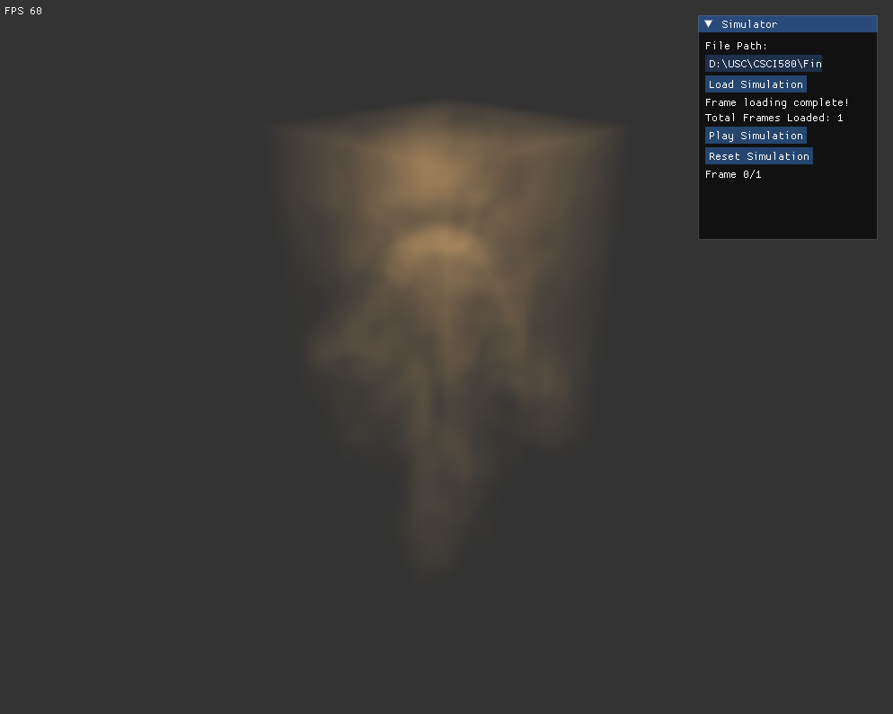

# Smoke Simulation Rendering via DirectX 11

## Raymarched Smoke and SDF Solids Rendering

This project demonstrates rendering smoke simulations and Signed Distance Field (SDF) solids using raymarching techniques implemented with DirectX 11. The simulations are calculated beforehand using a voxel based solver.

#### Smoke Simulation

#### SDF Solids

